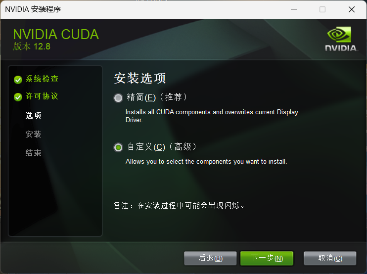

## 软件安装

1. Anaconda[官网下载](https://www.anaconda.com/download)，或者按照该博客来安装下载[安装下载](https://blog.csdn.net/qq_44000789/article/details/142214660)

2. Vscode[官网下载](https://code.visualstudio.com/Download)，或者按照该博客来[安装下载](https://blog.csdn.net/weixin_60915103/article/details/131617196)

3. 也可按照该视频配置

<iframe width="100%" height="468" src="//player.bilibili.com/player.html?bvid=BV1Fo46e3EAZ&p=1" scrolling="no" border="0" frameborder="no" framespacing="0" allowfullscreen="true"> </iframe>

---

## 环境配置

:::note
如果想要使用GPU进行深度学习模型的训练，就需要安装CUDA，我用的是Nvidia的GPU.
:::

### 安装CUDA以及cudnn

1. 检查自己电脑支持的CUDA版本：打开cmd执行.

```cmd
nvidia-smi
```


2. 前往[官网](https://developer.nvidia.com/cuda-toolkit-archive)下载自己电脑支持版本的 CUDA ，我选择12.8.0版本.

> 下载时选择自定义，勾选下载全部选项，并记住安装路径.




3. 检验是否安装成功：打开cmd执行.

```cmd
nvcc -V
```


4. 前往[官网](https://developer.nvidia.com/rdp/cudnn-archive)下载对应版本的 cudnn 压缩包，后进行解压，我选择8.9.7版本.

5. 进入指定目录（上文记住的安装路径），如C:\Program Files\NVIDIA GPU Computing Toolkit\CUDA\v12.8，将bin，include，lib三个文件夹拖入进行替换.<br><br>

### 创建虚拟环境并配置pytorch

1. 打开Anaconda Prompt，创建环境：

```shell
conda create -n ENV_NAME python=3.9
```

2. 激活环境：

```shell
conda activate ENV_NAME
```

3. 查看环境是否创建成功：

```shell
conda env list
```


4. 安装Pytorch命令复制网址： [https://pytorch.org/get-started/locally](https://pytorch.org/get-started/locally/)  选择自己版本的选项，在环境激活的情况下，复制命令并安装.


:::note
下载的包会比较大，如我的是3.5G，如比较小可能不是安装的GPU版本
:::

5. 创建.py文件，并将conda中刚刚安装环境中的python作为解释器，具体教程看:

<iframe width="100%" height="468" src="//player.bilibili.com/player.html?bvid=BV1Fo46e3EAZ&p=1" scrolling="no" border="0" frameborder="no" framespacing="0" allowfullscreen="true"> </iframe>

6. 运行下列代码，不报错即安装成功:

```python
import torch
print(torch.__version__)
print(torch.cuda.is_available())
```

7. 退出环境：
```shell
conda deactivate
```

8. 删除环境：
```shell
conda remove --name ENV_NAME --all
```


---

## 软件配置

### Jupyter Notebook

1. 打开Anaconda Prompt，激活环境后，执行：

```conda
pip install jupyter
```

2. 下载完后，执行，查看Jupyter的配置路径，只需看到路径，终端中输入 "N" 即可：

```conda
jupyter notebook --generate-config
```

3. 进入路径，打开 "jupyter_notebook_config" 文件，搜索：

```conda
The directory to use
```

>修改如下：

```diff lang="conda"
    ## The directory to use for notebooks and kernels.
    #  Default: ''
-   # c.ServerApp.root_dir = ''
+   c.ServerApp.root_dir = '默认打开路径'

```

4. 打开Anaconda Prompt，激活环境后，执行：

```conda
conda install ipykernel
```

5. 将环境写入内核：

```conda
python -m ipykernel --user --name 你创建环境的名字 --display-name "你创建环境的名字"
```

### d2l库安装

1. 打开Anaconda Prompt，激活环境后，执行：

```conda
pip install d2l
```

2. 运行下列代码，不报错即安装成功:

```python
import torch
from d2l import torch as d2l
```
