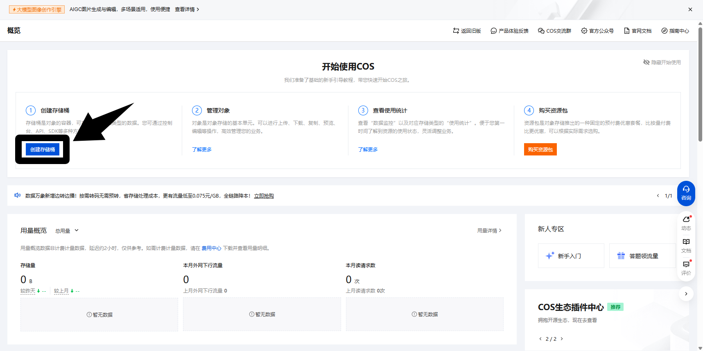
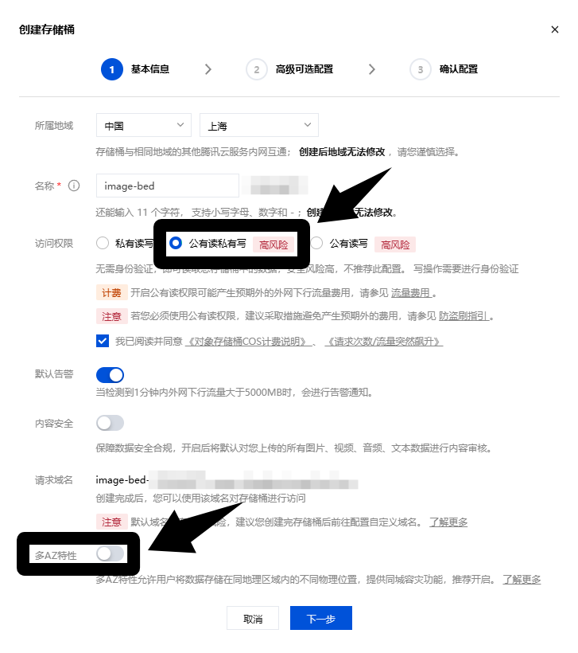
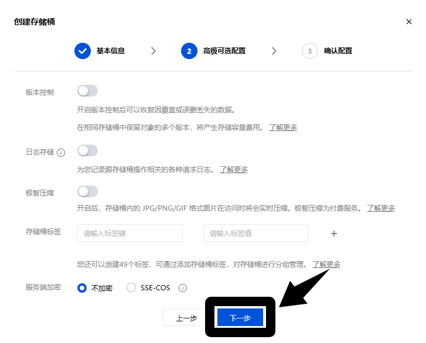
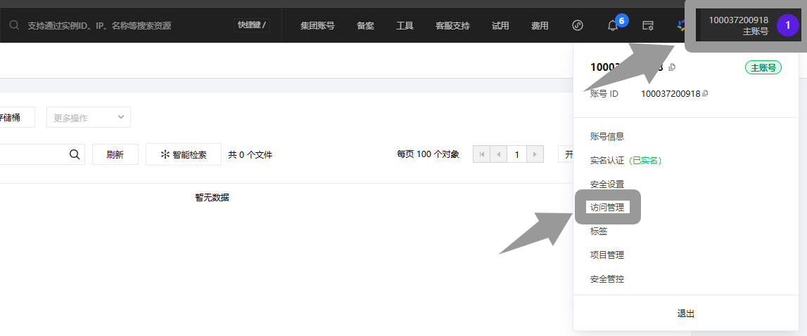
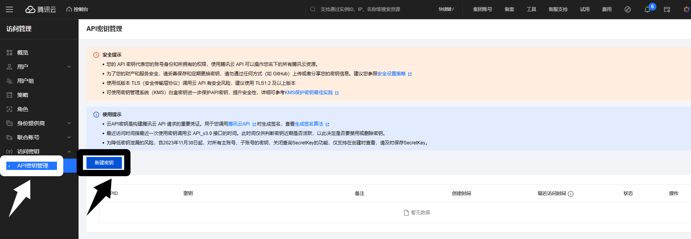
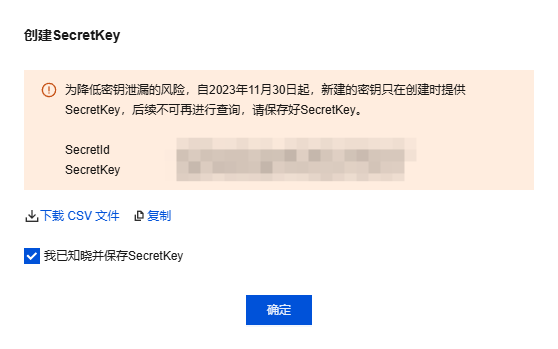
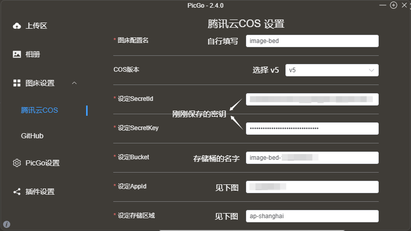
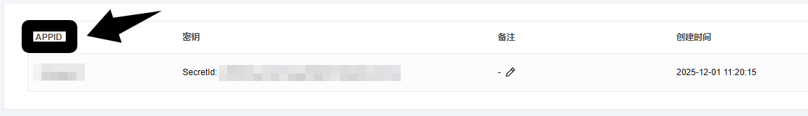
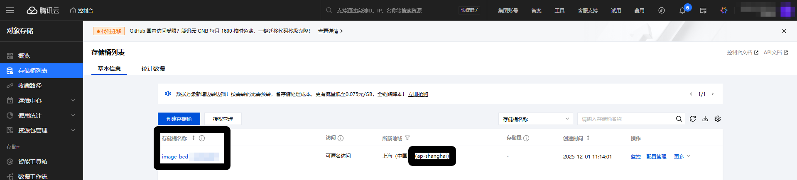

# PicGo 安装

给出官方GitHub网站, 自行下载

::github{repo="Molunerfinn/PicGo"}

---
# 创建存储桶

来到腾讯云[对象存储](https://console.cloud.tencent.com/cos)控制台，创建存储

访问权限选择 **公有读私有写** ，否则图片无法读取，其他的根据自己往下填写就可以。 地域建议离你所在的位置越近越好。

---
# 创建密钥

腾讯云头像–>[访问管理](https://console.cloud.tencent.com/cam/overview)–> [API密钥管理](https://console.cloud.tencent.com/cam/capi)，创建密钥，就会生成 **APPID、SecretId和SecretKey**

:::note
请务必保存好自己的密钥
:::

---
# PicGo设置

配置完即可顺利上传了, 还有很多功能自行探索