# VScode下载

略

---

# 离线安装 ESP-IDF 环境

## IDF 下载

IDF离线下载网址：[https://dl.espressif.cn/dl/esp-idf/](https://dl.espressif.cn/dl/esp-idf/)

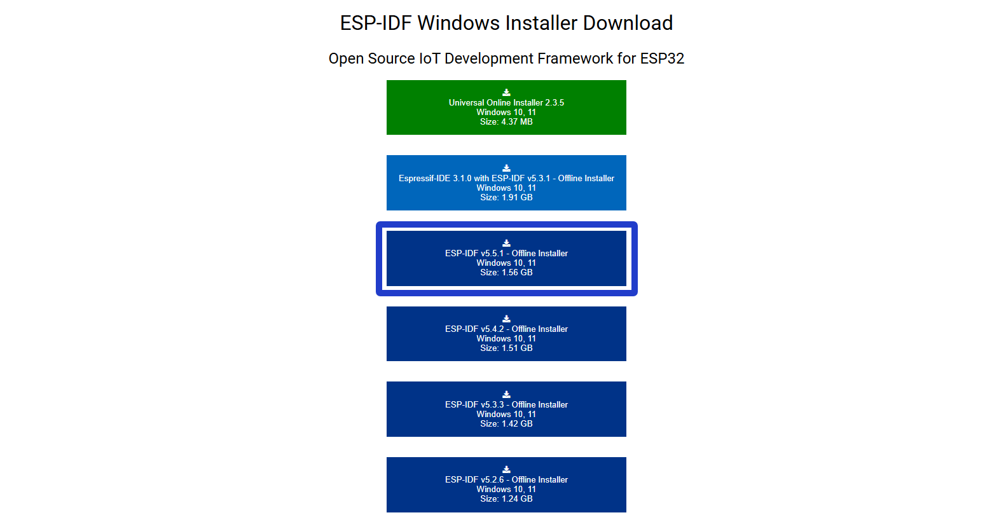
## IDF 安装

:::note
安装时必须关闭VSCode!
:::

:::note
在安装期间会弹出是否安装驱动的提示框，选择安装或者同意即可
:::

## 安装并配置 IDF 插件

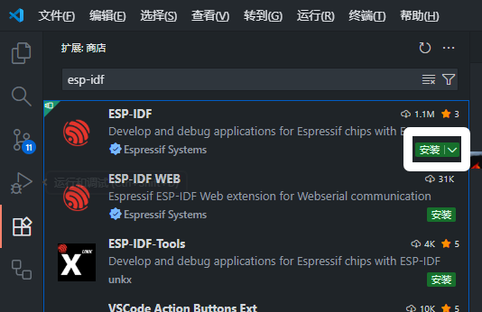

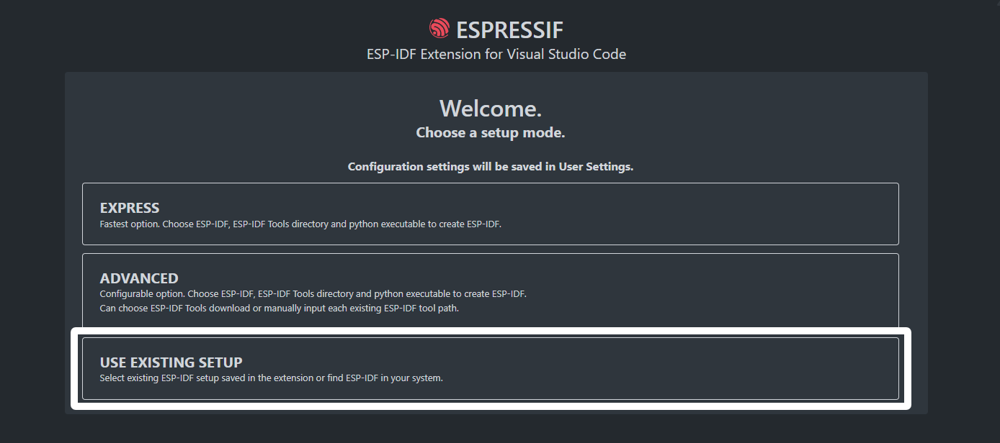

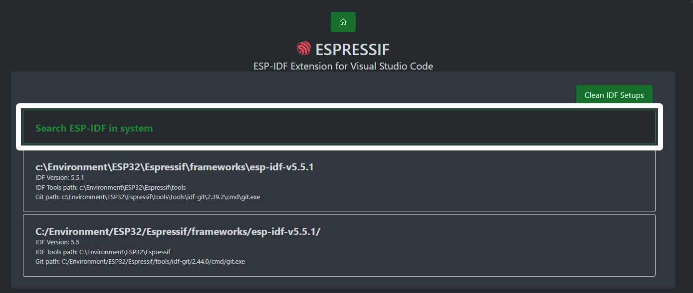

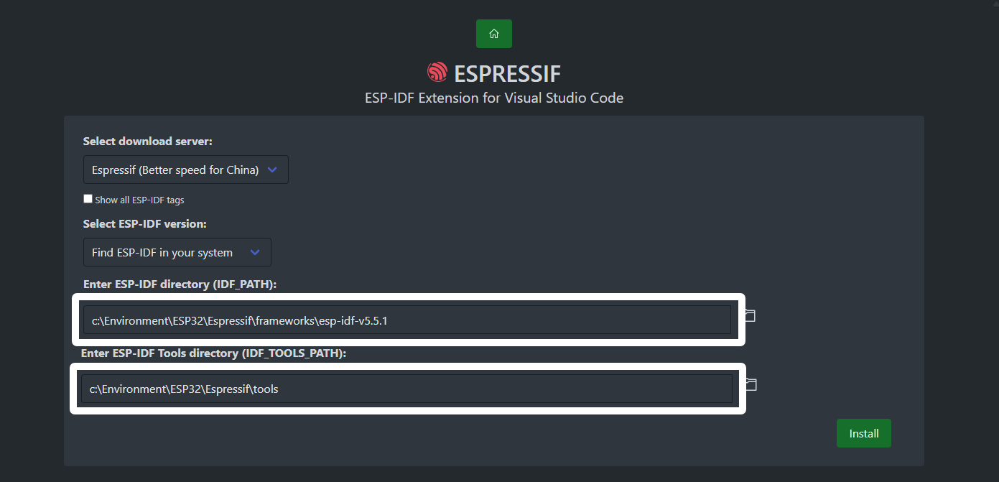

随后等待安装完成即可

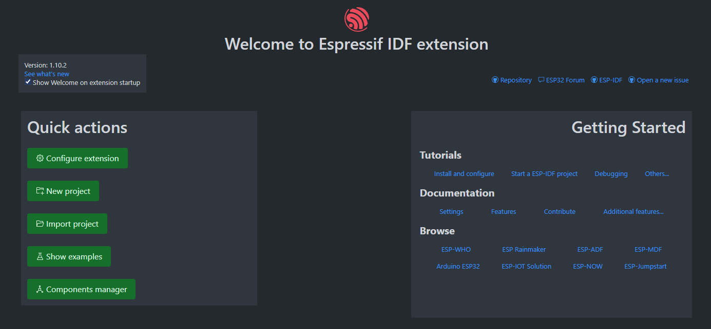

上图即为安装成功

---

## 新建工程并测试

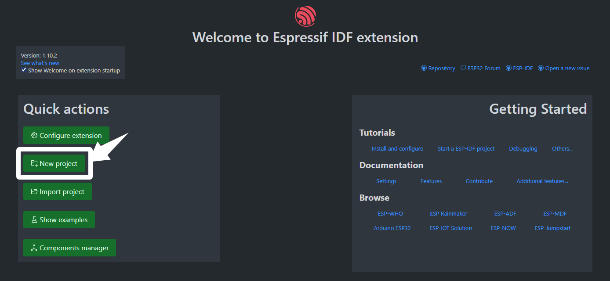

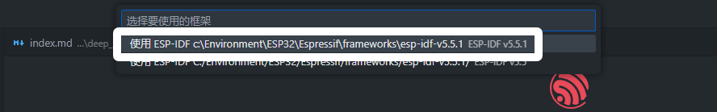

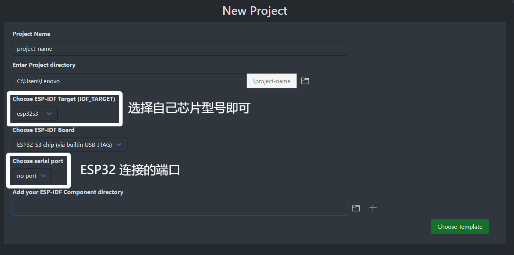

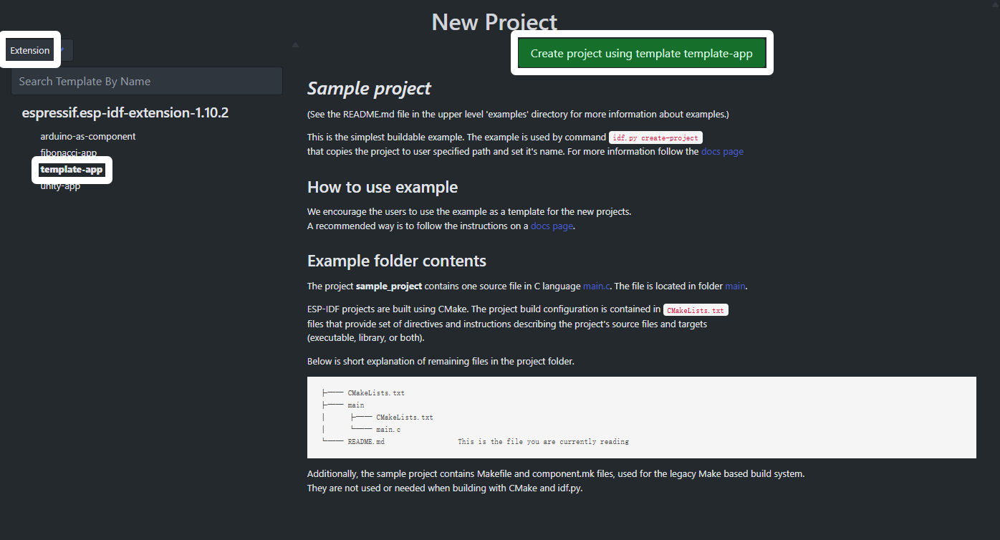

随后右下角会提示【工程已经创建完毕，是否用新窗口打开工程？】，打开即可

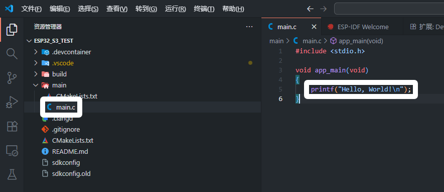

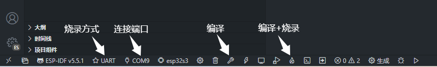

烧录后，**输出** 提示如下

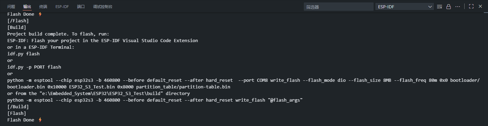

**终端** 提示如下

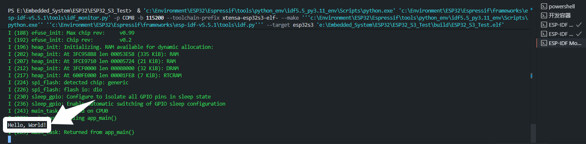

即环境安装成功

# 配置参数

:::note
这个每一个 `ESP32` 都不一样, 请根据自己买的型号修改
我买的是`S3 N16R8`
:::

:::note
如需要转移环境使用工程，请删除 `build` 文件夹后再尝试编译
:::