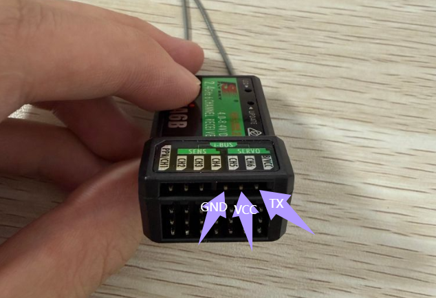
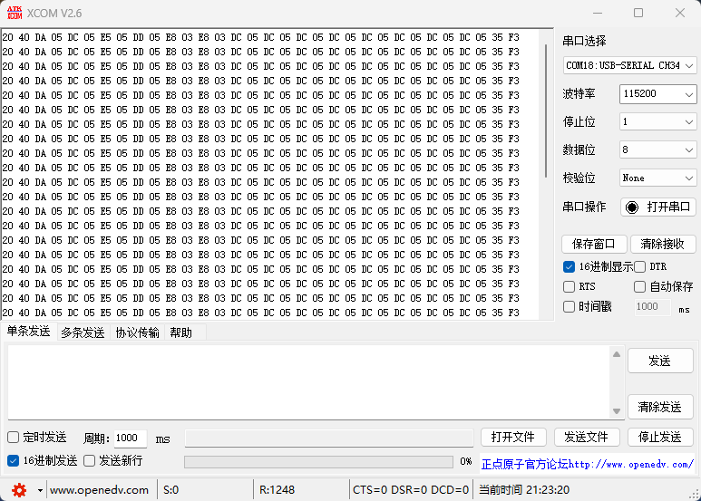
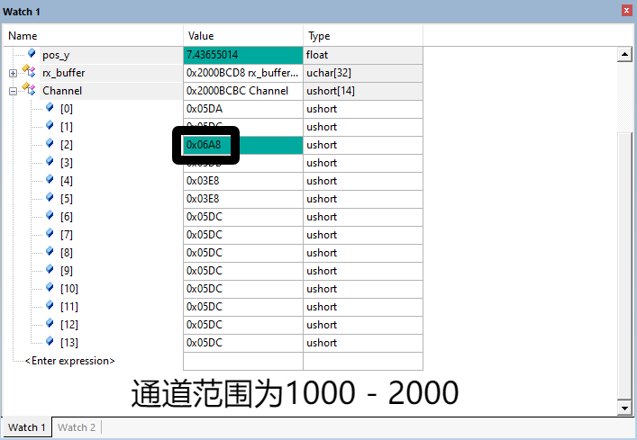

# 对码

具体观看该视频：

<iframe width="100%" height="468" src="//player.bilibili.com/player.html?bvid=BV1BL4y1M7p6&p=1" scrolling="no" border="0" frameborder="no" framespacing="0" allowfullscreen="true"> </iframe>

---

# 接线

STM32接线略

---

# 程序

下载 **remote.c** 与 **remote.h** 文件：[ Click! ](https://adrian-imagebed.oss-cn-hangzhou.aliyuncs.com/blog/romote.zip)

---

# 现象

## 帧模式

## STM32 Debug

