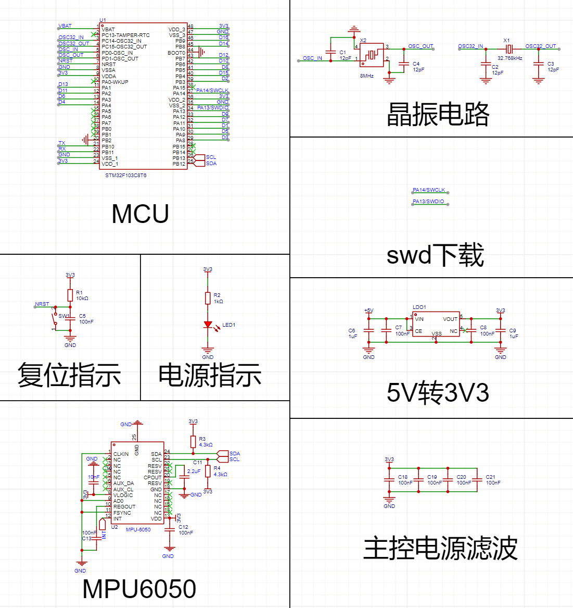
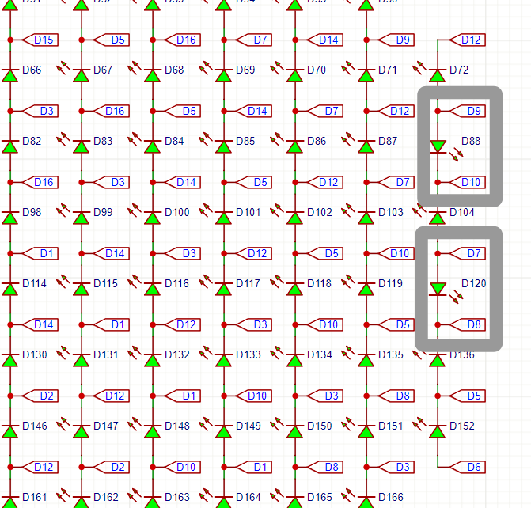

# 2月11日更新

在刷Youtube的时候看到了一个大佬做出的开源项目，简单来说就是用led贴片贴出来一个小屏幕，觉得很有意思。但虽说是开源的，但是资料并不完全，就想着自己从头开始把他复刻一遍，正好寒假里时间充裕，也算是自己做的第一个小项目。
	
具体的链接如下：[https://mitxela.com/projects/fluid-pendant](https://mitxela.com/projects/fluid-pendant)

由于我打算做出来的点阵屏幕有点小，并且只用两层板来打样，所以发现用74HC595这个芯片好像位置不太够，再加上想在这块板子上加上控制芯片和mpu6050来实现一些好玩的效果，就去搜了搜有没有用很少IO口就能控制很多LED灯的方法，还真有。

方法的名字叫做“查理复用”（Charlieplexing），是一种LED显示器多路复用的方法，主要使用到了IO口输出的三种状态：高电平、低电平，高阻态。

所谓“高阻态”，是指GPIO对外部电路表现出极大的阻抗。因阻抗很大，几乎不会吸入电流，也不会对外输出电流。而我们就可以让其中两个IO口分别呈现高低电平，而其他的所有都为高阻态的方式，来实现对led的控制。具体的化简电路图如下：

比如我想让 **LED5** 亮起，就给 **GPIO_1** 低电平，**GPIO_2** 高阻态，**GPIO_3** 高电平就能实现。这样算下来，n个IO口就能控制n*(n+1)个LED灯，可以大大节省IO口的资源。但是一个时间只能亮一个LED灯，所以需要用到视觉暂留原理，让每一行的每一个LED灯快速的亮起又灭掉，采用逐行扫描的方法，一次扫描完所有LED灯的频率大于60HZ，就能实现在我们看来很多灯在同一时刻亮的现象，但这同时也需要对控制芯片的时钟要求比较高。

## PCB

首先需要解决LED灯布线的问题，想到了一种方法，如下图所示：

通过对角线这样的走线方法，能够实现用16个IO口控制240（15*16）个led灯，且能保证布线不会很混乱，每一条总线都是斜向上或者斜向下，与其他总线平行的排布。由于要排成圆形的阵列，我删去了一些LED灯，最后留下了208个，最为最终的排列，如下图所示：

把这张原理图转换到PCB图，并且排列好，连好线，如下图所示：

|  |  |
| :-------------------------------------------: | :-------------------------------------------: |

这样的连线可以为主控的放置节省非常多的空间，背面只存在一些过孔，非常NICE。

随后就是绘制主控的电路图了，最后还是选择 **Stm32f103c8t6** ，芯片比较小，算力也够。从网上随便扒了个原理图复制下来，画了PCB，如下图所示：

|  |  |
| --------------------------------------------- | --------------------------------------------- |
|  |  |

之后想了想，发现不需要自己焊mpu6050，直接用现成的模块就可以了，还方便且不容易出错，稍微改动了一下PCB，并且把引出的引脚焊盘都扩大了一点，如下图所示:

顺便把钢网也开了

---

# 2月28日更新

 终于，在一万年后，我终于终于终于把这块板子焊好了，实物图如下，并进行了上机检测，在keil中可以识别到芯片，**WIN!**

|  |  |
| --------------------------------------------- | --------------------------------------------- |
|  |  |
|                                               |                                               |

---

# 3月1日更新

测试了一下焊完的电路，发现了原本电路图中的两处问题，问题修改后如下图所示，LED灯正负反转一下是最简单的解决方法，具体更合理的优化到之后再改一改。

---

# 3月2日更新

本来想着之后慢慢弄，但转念一想，干都干了，不如今天把大部分事情都搞完，随后就开始在keil中写屎山了··· 感觉之后写一个上位机会方便很多，但这都是后话了···

高低电平采用推挽输出，高阻态只需要将引脚模式改成输入就可以了。每次初始化亮一个灯，通过频率非常高的切换，让我们的眼睛看起来全都在亮。之后又发现总有两条斜线的灯不亮QAQ，**红温了**

经过排查之后发现是PB3和PB4这两个引脚在上电后默认配置为JTAG功能，如若需要恢复正常的输入输出模式，需要添加GPIO的复用。之后就又是枯燥的复制粘贴写代码

|  |  |
| --------------------------------------------- | --------------------------------------------- |
|  |  |

至此，这个小项目最基础的部分已经完成了，已经可以做一些小的屏幕展示。之后会继续在mpu6050模块的基础上开发一些更好玩的东西: )

---

# 5月13日更新

好久没推进这个项目了，实在是有点忙，出来冒个泡，顺便把项目开源了   **:)**

[https://github.com/Adrian-Pierre/LED_Project](https://github.com/Adrian-Pierre/LED_Project)