# CubeMX配置

芯片选择STM32H743XIH6，TFBGA 240封装

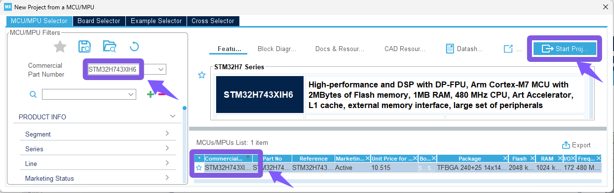

## RCC配置

HSE高速时钟使用外部晶振，其他采用默认设置。

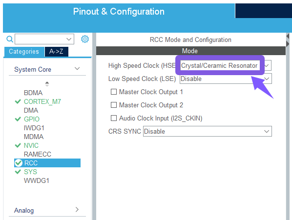

接下来配置时钟

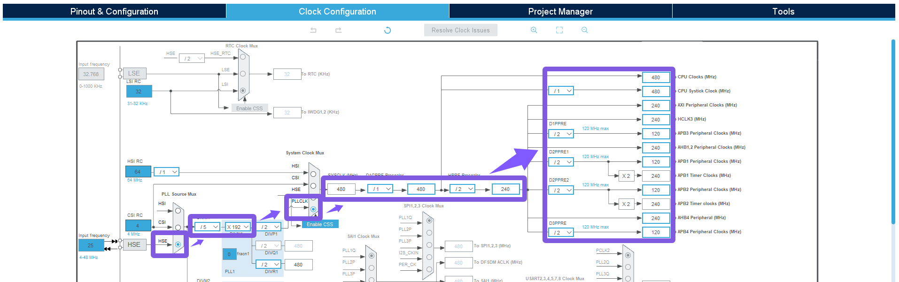

## [GPIO](https://so.csdn.net/so/search?q=GPIO&spm=1001.2101.3001.7020)配置

我这块板子上默认是PC13作为LED灯控制引脚：

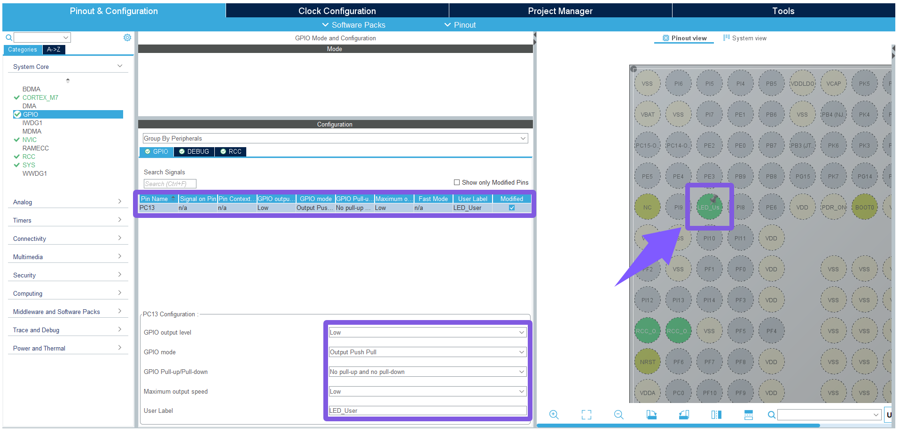

## DEBUG配置

:::note
该项一定要配置！！！
:::

我采用SW模式进行下载和调试程序：

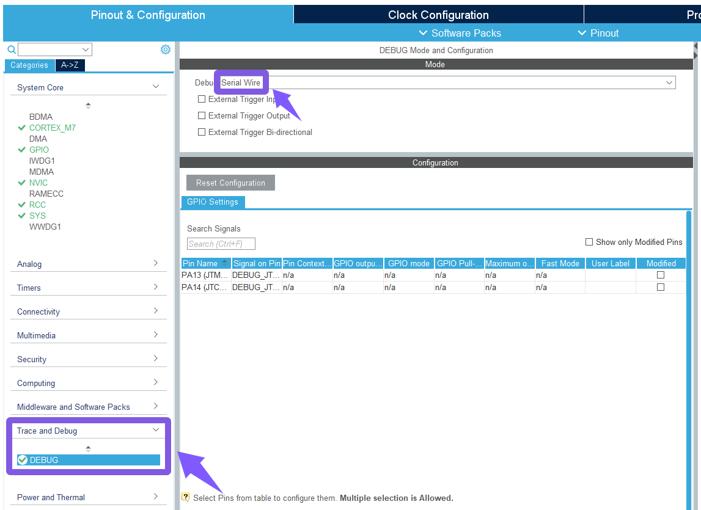

## 生成代码

部分设置如图所示：

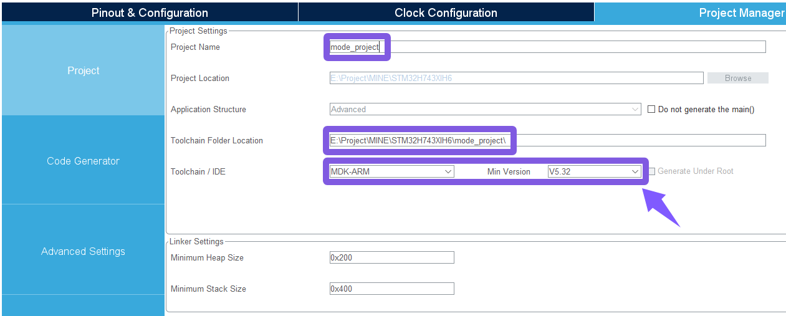

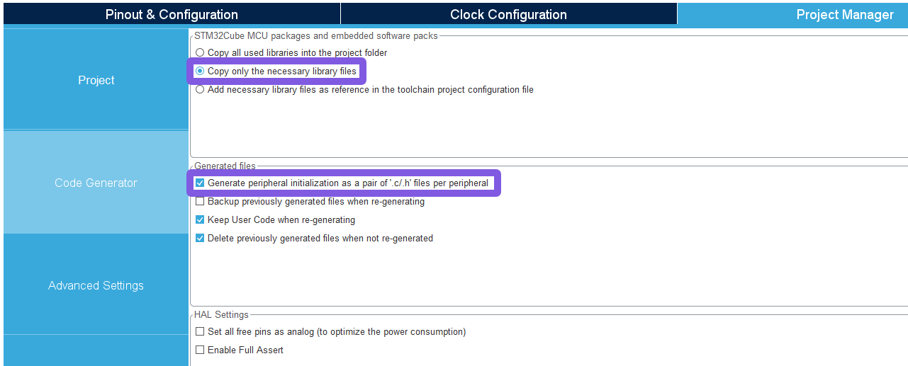

最后点击 **GENERATE CODE** 生成代码

# Keil5

## Target配置

打开 **Target** 选项卡：

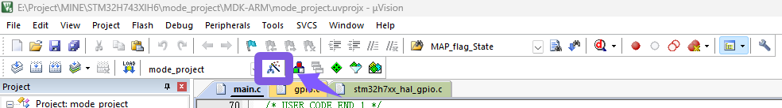

框中选项 **必须** 勾选，否则串口重定向后无法使用printf函数，程序会卡死：

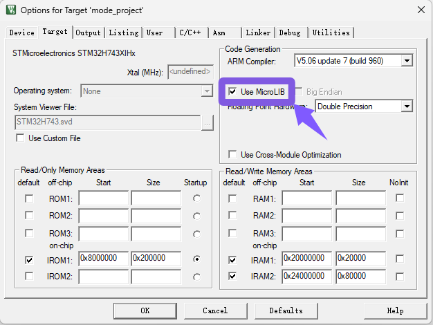

框中选项 **必须** 勾选，以便程序可以右键跳转到函数或变量定义处：

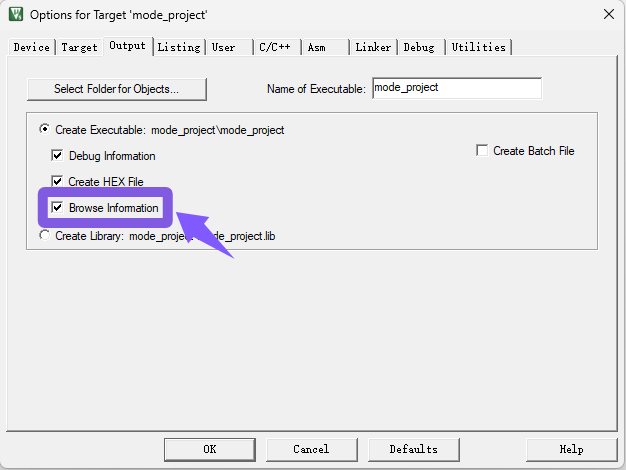

框中选择自己使用的仿真器，我用的是ST-Link，点击Settings后如下图所示：

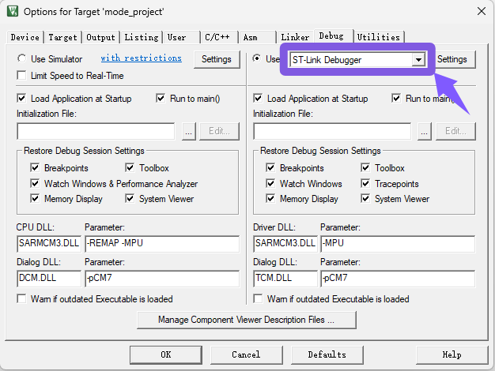

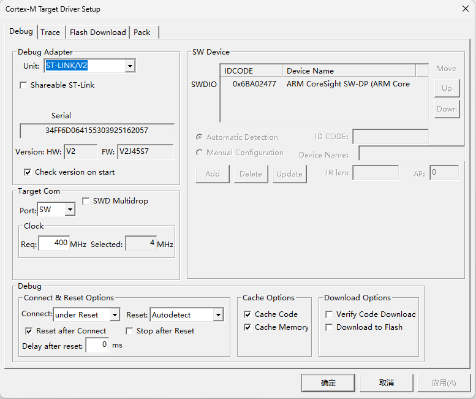

框中选项 **必须** 勾选

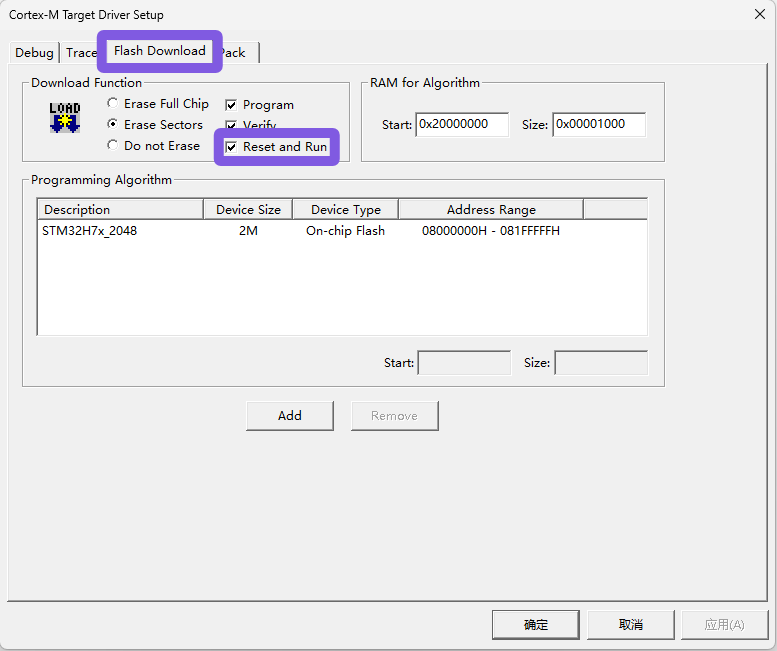

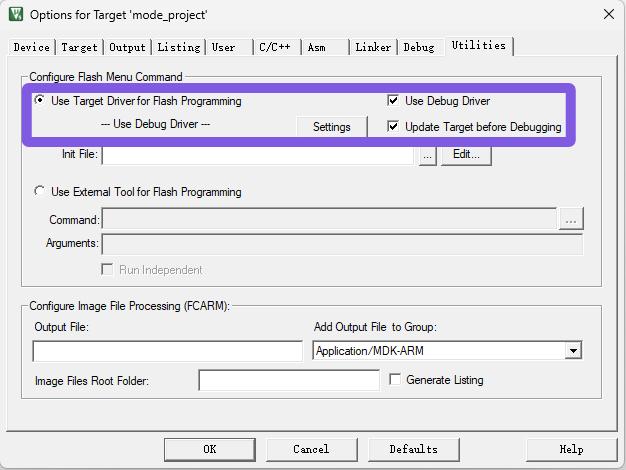

## Configuration配置

打开 **Configuration** 选项卡：

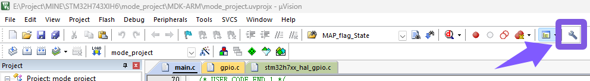

我习惯于使用 **UTF-8** 格式，并且加上代码补全提示：

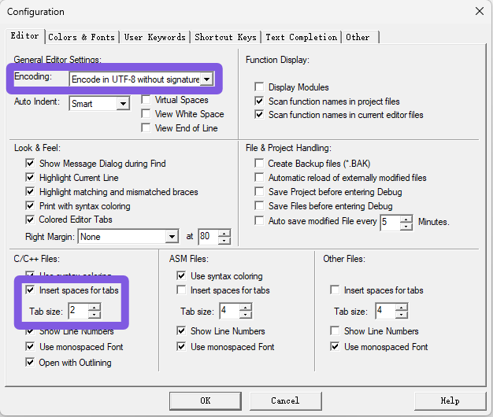