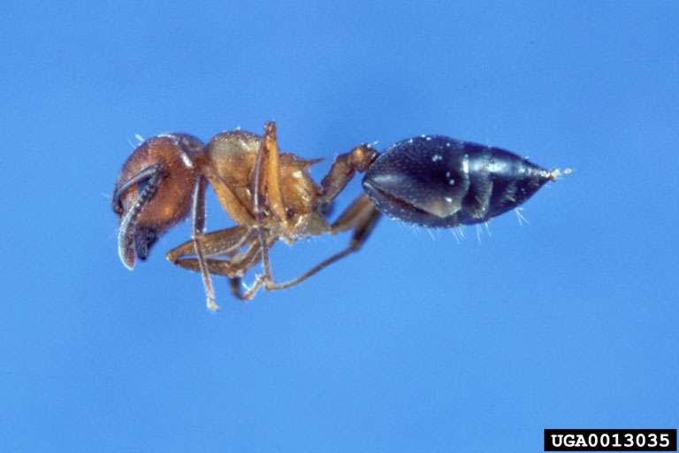
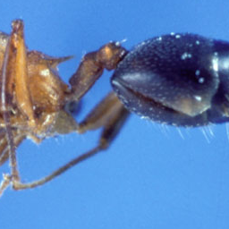

# All Import
	
```python
import os
import cv2
import torch
import torchvision
import numpy as np
from PIL import Image
from torch import nn
from torch.utils.data import Dataset 
from torch.utils.data import DataLoader  
from torch.utils.tensorboard import SummaryWriter
from torch.nn import functional as F
```

---

# Data 

```python
import torch
from torch.utils.data import Dataset 
from torch.utils.data import DataLoader 
import os
```

## Dataset

```python
Dataset??       #查看Dataset类的官方介绍  
help(Dataset)   #查看Dataset类的官方介绍
```

```python
from torch.utils.data import Dataset 
```

```python
class MyDataSet(Dataset):
    def __init__(self, root_dir, label_dir):
        self.root_dir       = root_dir
        self.label_dir      = label_dir
        self.path           = os.path.join(self.root_dir, self.label_dir)
        self.img_path_list  = os.listdir(self.path)

    def __len__(self):
        return len(self.img_path_list)
        
    def __getitem__(self, idx):
        img_name    = self.img_path_list[idx]
        img_path    = os.path.join(self.path, img_name)
        img         = Image.open(img_path)
        label       = self.label_dir
        
        return img, label
```

```python
my_dataset = MyDataSet("root_dir", "label_dir")
print(len(my_dataset))
img, label = my_dataset[idx]
```

## Dataloader

```python
from torch.utils.data import DataLoader 
```

```python
# 加载 CIFAR10 测试集，应用 ToTensor 转换
test_dataset = torchvision.datasets.CIFAR10(
    root        = "./dataset/CIFAR10", 
    train       = False, 
    download    = True, 
    transform   = torchvision.transforms.ToTensor()
)
```

```python
# 创建测试集 DataLoader
test_loader = DataLoader(
    dataset     = test_dataset, 
    batch_size  = 64, 
    shuffle     = True, 
    num_workers = 0, 
    drop_last   = False
)
```

```python
# 测试 DataLoader
writer = SummaryWriter("CIFAR10_DataLoader")

for epoch in range(2):
    step = 0
    for data in test_loader:
        imgs, targets = data
        # print(imgs.shape)      # torch.Size([4, 3, 32, 32])
        # print(targets)         # tensor([6, 9, 2, 4])
        writer.add_images("Epoch:{}".format(epoch), imgs, step)
        step += 1


writer.close()
```

---

# CV2 & Image
## Image

```python
from PIL import Image
```

```python
# 打开图片
img = Image.open("test.jpg")

# 显示图片
img.show()

# 转换格式
img = img.convert("L")   # 转为灰度图

# 调整大小
img = img.resize((200, 200))

# 保存图片
img.save("out.png")
```

## CV2

```shell
pip install opencv-python
```

```python
import cv2
```

```python
# 读取图片
img = cv2.imread("test.jpg")

# 显示图片
cv2.imshow("Image", img)
cv2.waitKey(0)
cv2.destroyAllWindows()

# 转为灰度
gray = cv2.cvtColor(img, cv2.COLOR_BGR2GRAY)

# 图像处理
blur = cv2.GaussianBlur(gray, (5, 5), 0)
edges = cv2.Canny(blur, 100, 200)

# 保存结果
cv2.imwrite("edges.jpg", edges)
```

---

# TensorBoard

```shell
pip install tensorboard
```

```python
Tensorboard??      #查看Tensorboard类的官方介绍  
help(Tensorboard)   #查看Tensorboard类的官方介绍
```

```python
import numpy as np
from torch.utils.tensorboard import SummaryWriter
``` 

```python
writer = SummaryWriter("My_TensorBoard")
```

## writer.add_image()

```python
img_path = "Relative_Image_Path"
img_PIL = Image.open(img_path)
img_array = np.array(img_PIL)
print(type(img_array))
print(img_array.shape)  # (512, 768, 3)
                        # HWC---------------------------------------
                        #                                          |
writer.add_image("Ant Image from PIL", img_array, 0, dataformats='HWC')
```

## writer.add_scalar()

```python
# y = 2x 
for i in range(100):
    writer.add_scalar("y=2x", 2*i, i)
```

```python
writer.close()
```

## 启动

本地启动TensorBoard（ **logdir=事件文件所在文件夹名** ）

```shell
tensorboard --logdir=My_TensorBoard --port=6007
```

---

# Transform

```python
from torchvision import transforms
```

```python
writer = SummaryWriter("My_TensorBoard")

# 跨平台路径 + 确保RGB
img_path = os.path.join("dataset", "hymenoptera_data", "train", "ants", "0013035.jpg")
img_PIL = Image.open(img_path).convert("RGB")
```



## transforms.ToTensor

```python
#img PIL -> tensor
img_tensor = transforms.ToTensor()(img_PIL)
```

```python
writer.add_image("PIL IMG", img_tensor, 0)
```

.png)

## transforms.Resize

```python
#img PIL -> Resize -> tensor
img_resize_PIL = transforms.Resize((256, 256))(img_PIL)
img_resize_tensor = transforms.ToTensor()(img_resize_PIL)
```

```python
writer.add_image("Resize IMG", img_resize_tensor, 0)
```


## transforms.RandomCrop

```python
# Random Crop（若不确定原图尺寸，考虑换 RandomResizedCrop(256)）
for i in range(5):
    img_random_crop_PIL = transforms.RandomCrop((256, 256))(img_PIL)
    img_random_crop_tensor = transforms.ToTensor()(img_random_crop_PIL)
    writer.add_image("Random Crop IMG", img_random_crop_tensor, i)
```

| %201.png) |        |
| ----------------------------------------------- | ------------------------------------------- |
| .png)     | .png) |

## transforms.Normalize

```python
# Tensor -> Normalize（训练用）；可视化时要反归一化
img_norm = transforms.Normalize([0.5, 0.5, 0.5], [0.5, 0.5, 0.5])(img_tensor)
img_norm_vis = img_norm * 0.5 + 0.5        # 仅用于可视化
```

```python
writer.add_image("Normalize IMG (for view)", img_norm, 0)
writer.add_image("Normalize IMG (for view)", img_norm_vis, 1)
```

.png)

## transforms.Compose

```python
# Compose: resize -> tensor -> normalize
transform = transforms.Compose([
    transforms.Resize((256, 256)),
    transforms.ToTensor(),
    transforms.Normalize([0.5, 0.5, 0.5], [0.5, 0.5, 0.5])
])
img_composed = transform(img_PIL)

# 可视化时反归一化
img_composed_vis = img_composed * 0.5 + 0.5
```

```python
writer.add_image("Tensor IMG (composed, for view)", img_composed, 0)
writer.add_image("Tensor IMG (composed, for view)", img_composed_vis, 1)
```

.png)

---

# Torchvision

## Download & Use Dataset

数据集下载官网： [CIFAR10](https://docs.pytorch.org/vision/stable/generated/torchvision.datasets.CIFAR10.html?highlight=cifar#torchvision.datasets.CIFAR10)

```python
# transform 预处理
dataset_transform = torchvision.transforms.Compose([
    torchvision.transforms.Resize((32, 32)),
    torchvision.transforms.ToTensor()
])
```

```python
# 官方数据集导入 & 使用
train_set = torchvision.datasets.CIFAR10(
    root        = "./dataset/CIFAR10", 
    train       = True, 
    download    = True, 
    transform   = dataset_transform
)


test_set = torchvision.datasets.CIFAR10(
    root        = "./dataset/CIFAR10", 
    train       = False,
    download    = True, 
    transform   = dataset_transform
)
```

```python
img, label = train_set[idx]
print(train_set[idx])
img.show()
```

```python
print(f"类别名称: {train_set.classes}")
print(f"类别名称与索引映射: {train_set.class_to_idx}")

print(f"图像尺寸: {img.size}, 图像类型: {type(img)}, 标签: {label}", f"标签名称: {train_set.classes[label]}")

print(f"训练集样本数: {len(train_set)}")
print(f"测试集样本数: {len(test_set)}")
```

---

# NN

官网介绍：[NN](https://docs.pytorch.org/docs/stable/nn.html)

```python
# 加载 CIFAR10 测试集，应用 ToTensor 转换
test_dataset = torchvision.datasets.CIFAR10(
    root        = "./dataset/CIFAR10",
    train       = False,
    download    = True,
    transform   = torchvision.transforms.ToTensor()
)

# 创建测试集 DataLoader
test_loader = DataLoader(
    dataset     = test_dataset,
    batch_size  = 64,
    shuffle     = True,
    num_workers = 0,
    drop_last   = False
)
```

## Class

```python
class Model(nn.Module):
    def __init__(self) -> None:
        super().__init__()
        self.conv1 = nn.Conv2d(1, 20, 5)
        self.conv2 = nn.Conv2d(20, 20, 5)

    def forward(self, x):
        x = F.relu(self.conv1(x))
        return F.relu(self.conv2(x))
```

```python
My_model = Model()
X = torch.tensor([1.0, 2.0, 3.0])
output = My_model(X)
```

## Convolution Layers

```python
from torch import nn
import torch.nn.functional as F
```

### Conv2d ()

官方介绍：[Conv2d()](https://docs.pytorch.org/docs/stable/generated/torch.nn.Conv2d.html#torch.nn.Conv2d)

动图解释：[Click!](https://github.com/vdumoulin/conv_arithmetic/blob/master/README.md)

#### 函数式调用

```python
torch.nn.functional.conv2d( input, 
							weight, 
							bias     = None, 
							stride   = 1, 
							padding  = 0, 
							dilation = 1, 
							groups   = 1)

```


```python
input = torch.tensor([[1, 2, 0, 3, 1],
                      [0, 1, 2, 3, 1],
                      [1, 2, 1, 0, 0],
                      [5, 2, 3, 1, 1],
                      [2, 1, 0, 1, 1]])

kernel = torch.tensor([[1, 2, 1],
                       [0, 1, 0],
                       [2, 1, 0]])
```

```python
input = torch.reshape(input, (1, 1, 5, 5))  # (N, C, H, W)
kernel = torch.reshape(kernel, (1, 1, 3, 3))  # (out_C, in_C, kH, kW)

print("input shape:", input.shape)    
print("kernel shape:", kernel.shape)
```

```python
output = F.conv2d(input, kernel, stride=1, padding=0)

print("output shape:", output.shape) # (1, 1, 3, 3)
print(output)
```

```python
output = F.conv2d(input, kernel, stride=2, padding=0)

print("output shape:", output.shape) # (1, 1, 2, 2)
print(output)
```

```python
output = F.conv2d(input, kernel, stride=1, padding=1)

print("output shape:", output.shape) # (1, 1, 5, 5)
print(output)
```

#### 模块化层（推荐）

```python
class My_Model(torch.nn.Module):
    def __init__(self):
        super().__init__()
        self.conv1 = torch.nn.Conv2d(
            in_channels     = 3,
            out_channels    = 16,
            kernel_size     = 3,
            stride          = 1,
            padding         = 1
        )

    def forward(self, x):
        x = self.conv1(x)
        return x
```

```python
wrtiter = SummaryWriter("CIFAR10_Conv2d")

step = 0

My_model = My_Model()

for epoch in range(2):
    step = 0
    for data in test_loader:
        imgs, targets = data
        output = My_model(imgs)

        # print("input shape:", imgs.shape)
        # print("output shape:", output.shape)

        wrtiter.add_images("Input:{}".format(epoch), imgs, step)

        output = output[:, :3, :, :]  # 只取前3个通道，方便可视化
        wrtiter.add_images("Onput:{}".format(epoch), output, step)

        step += 1

print("Done.")
```

---

## MaxPool Layers

官方介绍：[MaxPool2d()](https://docs.pytorch.org/docs/stable/generated/torch.nn.MaxPool2d.html#torch.nn.MaxPool2d)

```python
class My_Model(torch.nn.Module):
    def __init__(self):
        super().__init__()
        self.maxpool1 = torch.nn.MaxPool2d(
            kernel_size     = 3, 
            ceil_mode       = True,
            stride          = 2,
            padding         = 1
        )

    def forward(self, x):
        x = self.maxpool1(x)
        return x
```

```python
wtriter = SummaryWriter("CIFAR10_NN_MaxPool2d")

My_model = My_Model()
step = 0
for epoch in range(2):
    step = 0
    for data in test_loader:
        imgs, targets = data
        output = My_model(imgs)

        # print("input shape:", imgs.shape)
        # print("output shape:", output.shape)

        wtriter.add_images("Input:{}".format(epoch), imgs, step)
        wtriter.add_images("Output:{}".format(epoch), output, step)

        step += 1

print("Done.")
```

---

## Non Linear Layers

```python
class My_Model(torch.nn.Module):
    def __init__(self):
        super().__init__()
        self.ReLU1 = torch.nn.ReLU()
        self.sigmoid1 = torch.nn.Sigmoid()

    def forward(self, x):
        # x = self.ReLU1(x)
        x = self.sigmoid1(x)
        return x
```

```python
wtriter = SummaryWriter("CIFAR10_NN_Non_Linear_Act")

My_model = My_Model()
step = 0
for epoch in range(2):
    step = 0
    for data in test_loader:
        imgs, targets = data
        output = My_model(imgs)

        # print("input shape:", imgs.shape)
        # print("output shape:", output.shape)

        wtriter.add_images("Input:{}".format(epoch), imgs, step)
        wtriter.add_images("Output:{}".format(epoch), output, step)

        step += 1

print("Done.")
```

---

## Linear Layers

```python
class My_Model(torch.nn.Module):
    def __init__(self):
        super().__init__()
        self.linear1 = torch.nn.Linear(
            in_features    = 3 * 32 * 32, 
            out_features   = 10
        )

    def forward(self, input):
        output = self.linear1(input) 
        return output
```

```python
My_model = My_Model()
step = 0
for epoch in range(1):
    step = 0
    for data in test_loader:
        imgs, targets = data
        print("imgs shape before flatten:", imgs.shape)

        #imgs = imgs.view(imgs.size(0), -1)  # 展平操作
        imgs = torch.flatten(imgs, start_dim=1)  # 另一种展平操作
        print("imgs shape after flatten:", imgs.shape)

        output = My_model(imgs)
        print("output shape:", output.shape)

        step += 1

print("Done.")
```

---

## Sequential

```python
class My_Model(nn.Module):
    def __init__(self):
        super().__init__()
        self.conv1 = nn.Conv2d(
            in_channels     = 3, 
            out_channels    = 32, 
            kernel_size     = 5, 
            padding         = 2
        )

        self.maxpool1 = nn.MaxPool2d(
            kernel_size = 2,
        )

        self.conv2 = nn.Conv2d(
            in_channels     = 32, 
            out_channels    = 32, 
            kernel_size     = 5, 
            padding         = 2
        )

        self.maxpool2 = nn.MaxPool2d(
            kernel_size = 2,
        )

        self.conv3 = nn.Conv2d(
            in_channels     = 32, 
            out_channels    = 64, 
            kernel_size     = 5, 
            padding         = 2
        )

        self.maxpool3 = nn.MaxPool2d(
            kernel_size = 2,
        )

        self.flatten = nn.Flatten()

        self.linear1 = nn.Linear(
            in_features    = 64 * 4 * 4,    
            out_features   = 64
        )

        self.linear2 = nn.Linear(
            in_features    = 64,
            out_features   = 10
        )

        self.seq = nn.Sequential(
            self.conv1,
            self.maxpool1,
            self.conv2,
            self.maxpool2,
            self.conv3,
            self.maxpool3,
            self.flatten,
            self.linear1,
            self.linear2
        )
    
    def forward(self, input):
        output = self.seq(input)
        return output
```

```python
my_model = My_Model()
print(my_model)

input = torch.randn(64, 3, 32, 32)
print("input shape:", input.shape)
print("input:", input)

output = my_model(input)
print("output shape:", output.shape)
print("output:", output)
```

---

## Loss Function

官方文档：[Click !](https://docs.pytorch.org/docs/stable/nn.html#loss-functions)

```python
 # 定义损失函数
criterion = nn.CrossEntropyLoss()
        
# 计算损失
loss = criterion(outputs, targets)

#具体其他的损失函数及其参数可翻阅文档查看
```

---

## Backward & Optimizer

官方文档：[Backward](https://docs.pytorch.org/docs/stable/autograd.html#module-torch.autograd)

官方文档：[Optim](https://docs.pytorch.org/docs/stable/optim.html#module-torch.optim)

```python
optim = torch.optim.SGD(
    params      = my_model.parameters(),
    lr          = 0.01,
)
```

```python
for epoch in range(20):
    running_loss = 0.0

    for data in train_loader:
        imgs, targets = data
        outputs = my_model(imgs)
        
        # 定义损失函数
        criterion = nn.CrossEntropyLoss()
        
        # 计算损失
        loss = criterion(outputs, targets)
      
        optim.zero_grad()  # 清零梯度
        loss.backward()
        optim.step()       # 更新参数

        running_loss += loss.item()

    print(f"epoch {epoch} finished!")    
    print("loss:", running_loss)
```

---
# 模型保存与使用

以VGG16为例，这个模型数据集150G，就别下载了···

## 载入模型

```python
from torchvision.models import VGG16_Weights
```

```python
# 模型文件保存路径
os.environ['TORCH_HOME'] = r'E:\Deep_Learning\project\dataset\ImageNet'
```

 ```python
# 不加载权重
VGG16_MODEL_False = torchvision.models.vgg16(weights = None)

# 加载 ImageNet 预训练权重
VGG16_MODEL_True = torchvision.models.vgg16(weights=VGG16_Weights.IMAGENET1K_V1)
 ```

## 修改模型

### 例：CIFAR-10（10类）

只需替换最后的全连接层：

```python
import torch.nn as nn
import torchvision

# 不加载预训练权重（如果你想从头训练）
model1 = torchvision.models.vgg16(weights=None)

# 修改分类器最后一层
model1.classifier[6] = nn.Linear(in_features=4096, out_features=10)

```

### 例：迁移学习（加载预训练参数）

如果想用 **ImageNet 预训练权重** 来提升收敛速度和准确率，可以改为：

```python
from torchvision.models import VGG16_Weights

model1 = torchvision.models.vgg16(weights=VGG16_Weights.IMAGENET1K_V1)
# 冻结特征层参数
for param in model1.features.parameters():
    param.requires_grad = False

# 修改最后一层分类器
model1.classifier[6] = nn.Linear(4096, 10)

```

:::note
这样，模型只会训练最后几层，全卷积层保持 ImageNet 学到的通用特征，适合小数据集。
:::

## 保存模型

```python
VGG16_MODEL = torchvision.models.vgg16(weights = None)
```

```python
# 保存整个模型（不推荐做法）
torch.save(VGG16_MODEL, "./My_Model/VGG16_no_weights_All_Model.pth")

# 仅保存模型参数（推荐做法）
torch.save(VGG16_MODEL.state_dict(), "./My_Model/VGG16_no_weights_state_dict.pth")
```

## 使用模型

```python
# 直接加载整个模型（不推荐做法）
model = torch.load("./My_Model/VGG16_no_weights_All_Model.pth", weights_only = False)
print(model)
  
# 仅加载模型参数（推荐做法）
model = torchvision.models.vgg16(weights = False)  
model.load_state_dict(torch.load("./My_Model/VGG16_no_weights_state_dict.pth"))
print(model)
```

