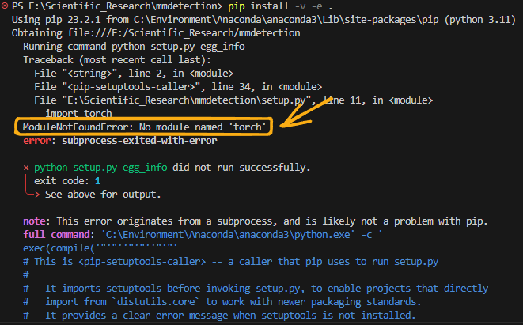
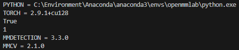

# MiniConda + Pytorch

具体看[另一篇博客](https://blog.anpier.xyz/posts/anacondapytorchd2l/)

# MMDetection

##  使用 [MIM](https://github.com/open-mmlab/mim) 安装 [MMEngine](https://github.com/open-mmlab/mmengine) 和 [MMCV](https://github.com/open-mmlab/mmcv)

```shell
pip install -U openmim
```

```shell
mim install mmengine
```

```shell
mim install "mmcv>=2.0.0"
```

我安装的 **mmcv** 版本是 **2.1.0**

## 安装 MMDetection。

```shell
git clone https://github.com/open-mmlab/mmdetection.git
```

```shell
cd mmdetection
# 这句代码每个人不同, 这一步的作用为进入刚刚 git clone 所在的文件夹
```

```shell
python -m pip install -v -e . --no-build-isolation
# "-v" 指详细说明，或更多的输出
# "-e" 表示在可编辑模式下安装项目，因此对代码所做的任何本地修改都会生效，从而无需重新安装。
```

:::note
注意, 版本较新的 **pip** 会创建一个新的隔离环境, 会导致找不到刚刚安装的 **torch** 库, 故需要加上 **--no-build-isolation** 来使用刚刚安装的环境
:::



# 环境测试

```python
import sys
print("PYTHON =", sys.executable)
try:
    import torch
    print("TORCH =", torch.__version__)
    print(torch.cuda.is_available())
    print(torch.cuda.device_count())
except Exception as e:
    print("TORCH NOT FOUND:", e)
try:
    import mmdet
    print("MMDETECTION =", mmdet.__version__)
except Exception as e:
    print("MMDETECTION NOT FOUND:", e)
try:
    import mmcv
    print("MMCV =", mmcv.__version__)
except Exception as e:
    print("MMCV NOT FOUND:", e)
```

正常输出如下 (可参考我的版本):

